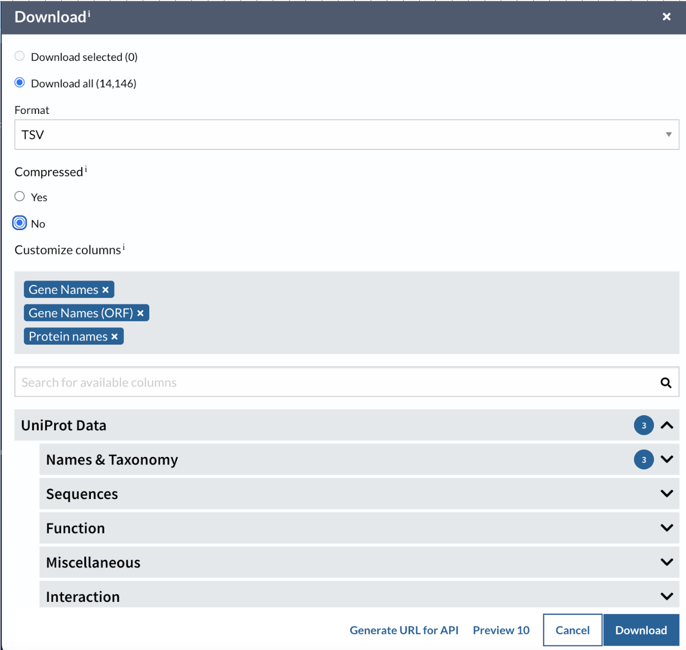

# 🧬 CrossFoldDB
**CrossFoldDB** is a framework for performing and storing precomputed **FoldSeek protein structure alignments** across related species and reference outgroups. 

---

## 🔍 Key Features

- Precomputed a set of reference proteomes vs a large proteome set structure-based protein alignments using FoldSeek
- Custom annotation integration from UniProt and genome metadata
- Supports large-scale parallel searches on HPC
- JSON conversion pipeline for downstream visualization and filtering

---

## 🌐 Public Examples

| Resource        | Link                                                                 |
|----------------|----------------------------------------------------------------------|
| MaizeGDB FoldSeek Viewer | [https://maizegdb.org/foldseek](https://maizegdb.org/foldseek) |
| Fusarium Protein Structure Portal | [https://fusarium.maizegdb.org/protein_structure/](https://fusarium.maizegdb.org/protein_structure/) |


## 🧪 Use Case Examples

### 🦠 *Aspergillus flavus*

Structure-based homology to *Aspergillus parasiticus* and *Aspergillus hiratsukae*. Outgroup filtering helps isolate Aspergillus-specific structures.  Outgroup species in this example are *Fusarium graminearum* and *Saccharomyces cerevisiae*. [Example datasets](https://ars-usda.box.com/s/v7qrygdzi0xj8sb8zd308ea0c5onepkm) 

---

## 📁 Directory Structure


```text
CrossFoldDB/
├── alignment/                           # Compressed AlphaFold/CIF inputs per species
└── <reference_species>_alignments/      # The alignment files between the reference (query) and the target proteomes, move to htdocs when done
|
├── structures/                          # Compressed AlphaFold/CIF inputs per species
│ └── <species>/
|
├── DB/                                  # FoldSeek formatted searchable databases
│ └── <species>DB/
|
├── htdocs/                              # The website code
|   ├── index.php                                 # index file to display the FoldSeek html code
|   ├── summary.html                              # Edit the summary text in this file
|   ├── examples.php                              # Add example sequences for the search bar
|   |
|   ├── alignments                                # The alignment files between the reference (query) and the target proteomes
|   |   ├── <reference_species>_alignments        
|   |
|   ├── <reference_species>_json                  # Meta data for the reference proteome, can have multiple references
|   |   ├── uniprot                               # One JSON file per protein in the proteome, this is the data generated in the main JSON folder. The file is named <Uniprot>.json
|   |   ├── alias                                 # Optional.  Allows to search by gene name (or other alias). One JSON file per protein in the proteome, the file is named <alias>.json
|   ├── js                                        # JavaScript files
|   | 
|   ├── css                                       # CSS files, if needed
|   | 
|   ├── img                                       # Image files
|
├── html/             # Output HTML with alignment summaries
|
├── JSON/             # Parsed JSON results (post-filtered), this can be renamed if multiple reference proteomes
|
├── log/              # Log files are stored here if Slurm is used
|
├── S1_buildFoldSeekDB.sh           # Build script for FoldSeek databases
├── S2_searchFoldSeek_parallel.sh   # Parallel search script (forward/reverse)
├── S3_extractJSON_parallel.sh      # Convert FoldSeek results to legacy format
├── S4_merge_JSON.sh                # Combine and filter results
├── S5_make_annotations.sh          # Add annotations for reference proteins
├── process_species_job.sh          # Slurm helper file for step 3, if not on Slurm then replace with the python script
├── untar_directory.sh              # Utility to unzip input CIFs in parallel
|
├── python/          # python scripts
|   ├──foldseek_search_parallel.py                     #Python code for Step 2
|   ├──extract_json_files_annotation_parallel.py       #Python code for Step 3
|   ├──merge_JSON_alignments.py                        #Python code for Step 4
|   ├──merge_JSON_alignments.py                        #Python code for Step 5
|
├── species_list.txt                    # meta data and paths related to each species   
|
├── tmp                                 # tmp folder for FoldSeek   
|
└── README.md
```


---

## 🧰 Installation

Requirements:

- [FoldSeek](https://github.com/steineggerlab/foldseek)
```bash
# Linux AVX2 build (check using: cat /proc/cpuinfo | grep avx2)
wget https://mmseqs.com/foldseek/foldseek-linux-avx2.tar.gz
tar -xvzf foldseek-linux-avx2.tar.gz
export PATH=$(pwd)/foldseek/bin/:$PATH
```

- Python 3.8+
- SLURM-based HPC environment with `sbatch`

---

## 🚀 Quickstart

### 1. Unpack structure and annotation files
Put all structure files in ./structures/<species>. Supports PDB and CIF files.  The scripts supports AlphaFold file format (AF-(.*?)-F1-model_v4.cif.gz) or ESMFold (*.pdb.gz). Other formats would require a change to the regular expressions in "foldseek_search_parallel.py", "extract_json_files_annotation_parallel.py" and "merge_JSON_alignments.py". Files are stored in ./structures/<species>/<species>


Download the annotations for each species from Unirpot.  Save the Gene Names, Gene Names (ORF), Protein names.



### 2. Create a species list
```bash
touch species_list.txt

Species	HTML	DB	CIF	Annotation	UniProtID	SpeciesID
flavus	./html/flavus	./DB/flavusDB	./structures/flavus/flavus	./annotation/flavus.tsv	UP000596276	332952
hiratsukae	./html/hiratsukae	./DB/hiratsukaeDB	./structures/hiratsukae/hiratsukae	./annotation/hiratsukae.tsv	UP000630445	1194566
parasiticus	./html/parasiticus	./DB/parasiticusDB	./structures/parasiticus/parasiticus	./annotation/parasiticus.tsv	UP000326532	5067
graminearum	./html/graminearum	./DB/graminearumDB	./structures/graminearum/graminearum	./annotation/graminearum.tsv	UP000070720	229533
cerevisiae	./html/cerevisiae	./DB/cerevisiaeDB	./structures/cerevisiae/cerevisiae	./annotation/cerevisiae.tsv	UP000070720	229533
```


### 3. Build FoldSeek databases
```bash
./S1_buildFoldSeekDB.sh ./structures/flavus/flavus ./DB/flavusDB
./S1_buildFoldSeekDB.sh ./structures/hiratsukae/hiratsukae ./DB/hiratsukaeDB
./S1_buildFoldSeekDB.sh ./structures/parasiticus/parasiticus ./DB/parasiticusDB
./S1_buildFoldSeekDB.sh ./structures/graminearum/graminearum ./DB/graminearumDB
./S1_buildFoldSeekDB.sh ./structures/cerevisiae/cerevisiae ./DB/cerevisiaeDB
```

### 4. Run FoldSeek searches (forward and reverse)
Repeat forward and reverse searches for each species. Continue until the number of output JSON files stabilizes (≈ number of reference structures).
```bash
./S2_searchFoldSeek_parallel.sh flavus forward
./S2_searchFoldSeek_parallel.sh hiratsukae forward
./S2_searchFoldSeek_parallel.sh parasiticus forward
./S2_searchFoldSeek_parallel.sh graminearum forward
./S2_searchFoldSeek_parallel.sh cerevisiae forward
```

### 5. Convert JSON results to legacy format
```bash
./S3_extractJSON_parallel.sh
```

### 6. Merge and filter JSON outputs
```bash
./S4_merge_JSON.sh
```

### 7. Generate reference annotations (optional)
```bash
./S5_make_annotations.sh 
```
## 🌍 Species Included


### Reference 
- *Aspergillus flavus*

### Outgroups
- *Fusarium graminearum*
- *Saccharomyces cerevisiae*

### Focal *Aspergillus* Species
- *Aspergillus parasiticus*
- *Aspergillus hiratsukae*

[Example datasets](https://ars-usda.box.com/s/v7qrygdzi0xj8sb8zd308ea0c5onepkm) can be found at MaizeGDB.

## 📫 Citation & Contact
If you use CrossFoldDB in your research, please cite this repository.

For questions, issues, or collaborations, contact the MaizeGDB team or submit a GitHub issue.


